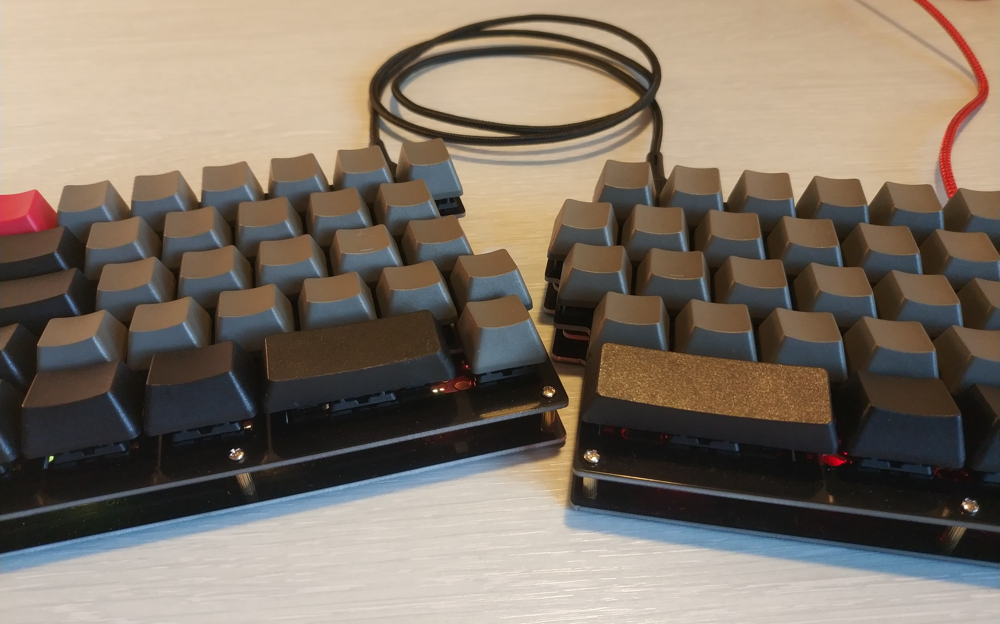

DIY quefrency rev3 build
========================

Keymap and details on a quefrency rev3 build.

## Firmware

Just use [qmk](https://qmk.fm/) to compile and flash the firmware.

After setting up qmk, copy the `keymap` folder to the qmk toolchain (`~/qmk_firmware/keyboards/keebio/quefrency/keymaps`), build the firmware, and flash it (the reset button on the back puts the keyboard into bootloader mode):
```
qmk compile -kb keebio/quefrency/rev3 -km keymap
qmk flash -kb keebio/quefrency/rev3 -km keymap
```

*Note*: The keymap is designed for connecting the keyboard on the right half.

## Parts

* [rev3 PCB](https://keeb.io/products/quefrency-60-65-split-staggered-keyboard-1?variant=32384644120670) from keebio
* [Left half](https://keeb.io/products/quefrency-60-65-split-staggered-keyboard-1?variant=32026895515742) and [right half](https://keeb.io/products/quefrency-60-65-split-staggered-keyboard-1?variant=32026895712350) plates
* 70 Blue [Cherry switches](https://kbdfans.com/collections/cherry-switches/products/cherry-pcb-mount-5pin-switches-10pcs?variant=21746277056560)
* Blank PBT [keycaps](https://ymdkey.com/collections/keycap-1/products/ymdk-dolch-thick-pbt-ansi-iso-keyset-oem-profile-key-caps-for-mx-mechanical-keyboard?variant=31483599749181), a [split space bar](https://ymdkey.com/collections/oem-profile/products/ymdk-laser-etched-ansi-iso-oem-profile-thick-pbt-keycap-for-mx-mechanical-keyboard-filco-ymd96-rs96-ymd75-kbd75-fc980m-vea-75?variant=31889940774973), and the [iso enter key](https://ymdkey.com/collections/keycap-1/products/ymdk-dolch-thick-pbt-ansi-iso-keyset-oem-profile-key-caps-for-mx-mechanical-keyboard?variant=31483600011325)
* 5 [Stabilizers](https://ymdkey.com/collections/stabilizers-and-feet/products/pcb-mounted-cherry-pcb-stabilizers-satellite-axis-7u-6-25u-2u-3u-6u-for-mechanical-keyboard-modifier-keys)
* And some cables

## Result


